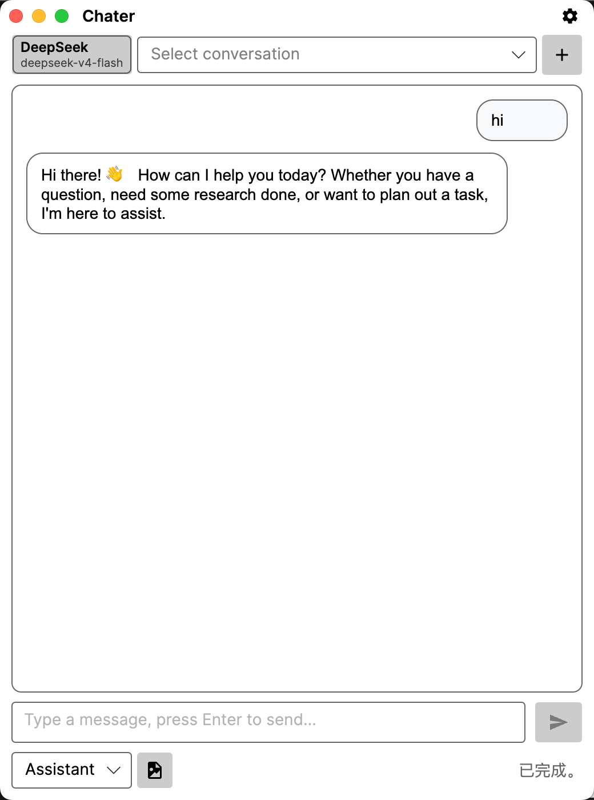
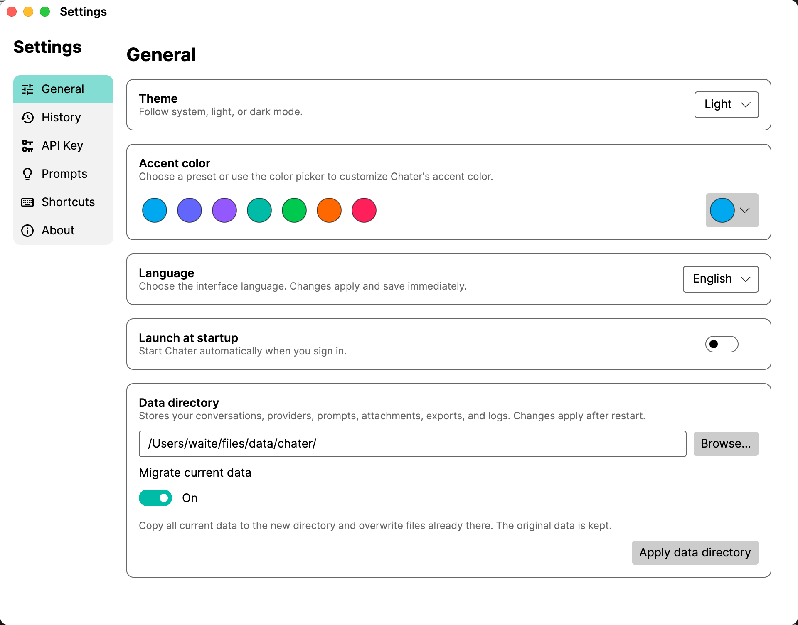

# Chater

> A fast, native desktop AI chat app that keeps your conversations and configuration in your hands.

Chater is built for people who want an AI workspace without a heavy browser shell. It is a native .NET and Avalonia application designed for a small footprint, quick startup, low memory use, and transparent local data.

<p align="center">
  <strong>Native desktop</strong> · <strong>Lightweight</strong> · <strong>Fast</strong> · <strong>Local-first</strong>
</p>





## Why Chater?

| What matters | How Chater approaches it |
| --- | --- |
| **Start quickly** | A focused native desktop app for opening a conversation without waiting on a browser workspace. |
| **Use less memory** | No Electron-style browser shell: resources stay focused on the app and your work. |
| **Keep a small footprint** | Built with .NET and Avalonia, with Native AOT-compatible project configuration and platform-specific publishing targets. |
| **Know where your data is** | Conversations, skills, settings, attachments, and logs live locally in a user-controlled data directory. |
| **Choose your AI provider** | Connect OpenAI, Ollama, or any OpenAI-compatible endpoint. |

## A focused AI workspace

### Fast by default

- Native window chrome, system-tray controls, and global shortcuts for getting to chat quickly.
- Streaming responses with Markdown rendering.
- System, light, and dark themes.
- English, Simplified Chinese, and Traditional Chinese interfaces.

### Bring your own model

- Configure API keys, endpoints, default models, and model lists from Settings.
- Use local Ollama models or remote OpenAI-compatible services.
- Send images to multimodal models by choosing a file or pasting an image from the clipboard.

### Local data, clearly owned

- Conversations and messages are stored in a local SQLite database—easy to inspect and back up.
- Logs are written to `logs/` inside the data directory for straightforward troubleshooting.
- Choose a custom data directory in General Settings, with an option to migrate current data to it.
- API keys stay local and are only sent to the provider endpoint you explicitly configure for a request.

### Reuse the way you work

- Start with a built-in general chat skill or create your own reusable skills.
- Give writing, analysis, translation, and everyday chat their own prompts and behavior.
- Browse, reopen, and continue previous conversations.

## Get started in a minute

1. Launch Chater.
2. Open **Settings** and add a provider with an API key, or connect a local Ollama instance.
3. Select a model and a skill.
4. Start chatting. For image input, choose an image file or paste one from the clipboard.

## Run locally

### Prerequisites

- .NET SDK 10.0 or later
- A desktop environment supported by Avalonia
- Provider credentials or a locally running Ollama instance

```bash
dotnet restore Chater.sln
dotnet run --project Chater/Chater.csproj
```

On first launch, Chater creates its local database and support directories. The default location follows your operating system's application-data conventions; you can choose a different location in **General Settings**.

## Build and test

```bash
dotnet build Chater.slnx
dotnet test Chater.slnx --no-build
```

Release build:

```bash
dotnet build Chater.slnx --configuration Release
```

Current publishing targets:

- `win-x64`
- `win-arm64`
- `osx-x64`
- `osx-arm64`

See [docs/release/build-and-artifacts.md](docs/release/build-and-artifacts.md) for release and artifact guidance.

## Project structure

```text
Chater/
├── AI/            Agents, conversations, and model calls
├── Data/          SQLite access, repositories, and migrations
├── Services/      Settings, logging, localization, and window services
├── ViewModels/    MVVM presentation logic
└── Views/         Avalonia windows and settings pages
```

## License

See [LICENSE](LICENSE) for licensing information.
